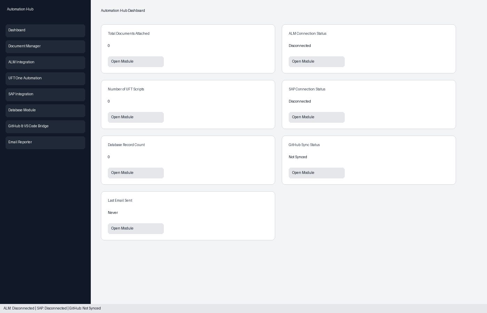

# UFT SAP Tests - Interactive Automation Hub

A modular **tkinter + ttk** desktop dashboard for managing QA automation workflows in one place.

## Features

- Sidebar navigation with 7 modules + dashboard home
- Dashboard cards with clickable navigation and live summary metrics
- Bottom status bar for ALM/SAP/GitHub state
- Professional dark-sidebar + light-content styling

### Modules

1. **Document Manager**
   - Attach `.docx` files
   - Remove documents
   - Save/update requirement notes
   - Local JSON persistence (`data/documents.json`)

2. **ALM Integration**
   - Simulated connection form and status updates
   - Create/update/delete manual test cases
   - Sync-to-ALM simulation

3. **UFT One Automation**
   - Generate `.mts` UFT template scripts
   - Run script simulation with Pass/Fail statuses
   - Link scripts to repository URL

4. **SAP Integration**
   - Simulated SAP connection (default client `800`)
   - Project/transaction selection
   - Mock SAP data retrieval and transaction test
   - Multi-project support

5. **Database Module**
   - SQLite database auto-created at `data/automation_hub.db`
   - CRUD operations + search/filter
   - CSV export

6. **GitHub & VS Code Bridge**
   - Simulated clone/push/pull operations
   - Launch `code <path>` for VS Code integration
   - Sync status + timestamp + recent commits list

7. **Email Reporter**
   - Recipients, subject, body, attachment
   - Recipient checkbox list and email templates
   - Preview panel
   - Simulated send with last-sent timestamp

## Setup

### Prerequisites

- Python 3.10+
- Windows recommended (for UFT/SAP and VS Code workflows)

### Install

```bash
pip install -r requirements.txt
```

### Run

```bash
python main.py
```

## Screenshot Description


Preview image:



The UI presents:
- Dark left sidebar with module navigation buttons
- Light main content panel with forms, tables, and actions
- Dashboard cards for document count, ALM/SAP status, UFT script count, DB count, GitHub sync, and last email sent
- Status bar across the bottom for current system connectivity state

## Data and Artifacts

- `data/documents.json` — attached document references and notes
- `data/automation_hub.db` — SQLite records
- `artifacts/scripts/*.mts` — generated UFT template scripts
